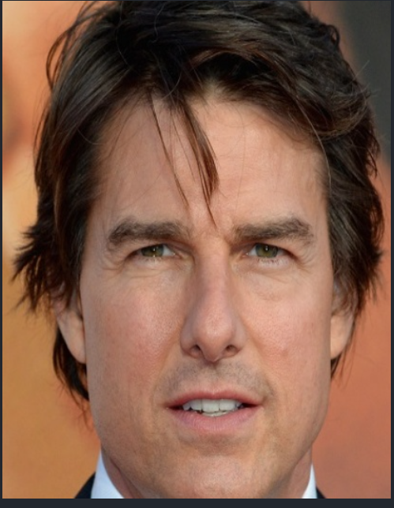

# BuildClub Technical Round – Passport Size image maker

## Description of Approach

This project implements a passport-size image creator using OpenCV and Python. The approach consists of the following key components:

### 1. Interactive Image Cropping
- Uses mouse event callbacks to allow users to select regions of interest by drawing rectangles
- Implements click-and-drag functionality to define the cropping area
- Provides real-time visual feedback with a green rectangle overlay during selection

### 2. Image Processing Pipeline
- Loads input images from the `assets/` directory
- Captures mouse events (left button down, mouse move, left button up) to track selection coordinates
- Validates the selected region to ensure it meets minimum size requirements (> 5 pixels in both dimensions)
- Automatically corrects coordinate ordering to handle selections made in any direction

### 3. Passport Size Specifications
- Targets India passport photo dimensions: 35mm x 45mm
- Converts to pixel dimensions at 300 DPI: 413 x 531 pixels
- Allows flexible cropping with user-defined regions that can be resized to meet specifications

### 4. User Interface
- Simple OpenCV window-based interface
- Live preview of the original image with selection overlay
- Intuitive mouse-based interaction for non-technical users

### Technical Implementation
- Built with OpenCV for image processing and display
- NumPy for efficient array operations
- Event-driven architecture using OpenCV's mouse callback system
- Modular code structure with utilities separated into `utils.py`

## Steps to Run the Model

### Prerequisites
- Python 3.7 or higher
- pip package manager

### Installation

1. **Clone the repository**
   ```bash
   git clone https://github.com/josephsaviokav/BuildClub_subPanel.git
   cd BuildClub_subPanel
   ```

2. **Install required dependencies**
   ```bash
   pip install -r requirements.txt
   ```
   
   This will install:
   - OpenCV (cv2)
   - NumPy

### Running the Application

3. **Place your image in the assets folder**
   - Add your image file to the `assets/` directory
   - Or use the provided `tom.jpg` sample image

4. **Run the main script**
   ```bash
   python src/main.py
   ```

5. **Using the application**
   - A window titled "Original Image" will appear showing your image
   - Click and drag with the left mouse button to select the area you want to crop
   - A green rectangle will appear showing your selection
   - Release the mouse button to finalize the selection
   - Press any key to close the window
   - The cropped image will be saved in the `results/` directory

### Keyboard Controls
- Press any key to exit the application

### Troubleshooting
- If the image doesn't load, ensure the path in `main.py` is correct (line 10)
- For images in the `assets/` folder, use the path: `../assets/your_image.jpg`
- Make sure the `results/` directory exists for saving output images


### Screenshot of the final output
